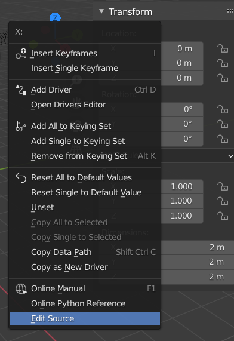
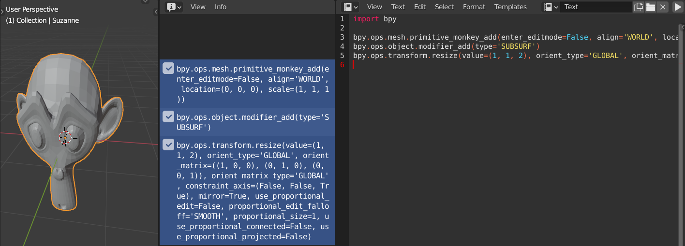
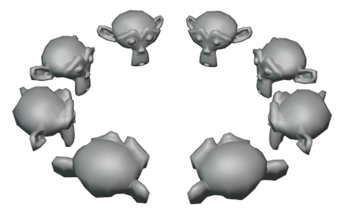

 


**In dieser Übung wollen wir uns mit dem Setup von Blender für Scripting, sowie den Tools, die uns von Blender selbst dafür zur Verfügung gestellt werden beschäftigen.**

## Blender Setup
- Ladet euch zunächst von [Blender.org](https://www.blender.org/download/) die aktuelle Version von Blender herunter. Dieses Script behandelt die Version 2.90. Zukünftige Versionen könnten eventuell Änderungen an der API vornehmen, normalerweise bleibt die API bei Updates jedoch großteils unverändert.

<!--Link zu CG Webseite? Ist ja nicht immer alles Online und vlt auch nicht immer auf Davids Webspace?-->
> Eine Einführung in Blender selbst, sowie Links mit Tutorials etc. gibt es im [**Script zur Veranstalltung Computergrafik**](https://sftp.hs-furtwangen.de/~lochmann/computergrafik2019/script/chapter01/lecture01/) 

- Öffnet Blender und in Blender die ***Preferences***

- Aktiviert hier nun im ***Interface*** Tab *Python Tooltips* und *Development Extras*

> **Python Tooltips** zeigt beim Hovern mit dem Cursor über einen Wert dessen Pfad in der Blender API an.<br>
> 
> 
> **Development Extras** Ermöglicht einige Funktionen, die uns das Scripten erleichter, wie z.b. das Anzeigen des Python-Codes von Features (`RMB` → *Edit Source*)<br>
> 

## Scripting Tools

- Wechselt nun zum Workspace-Tab ***Scripting***

 <!--TODO Bild Counter einfügen-->
- Der **<span style="color: ForestGreen">3D View</span>** <span class="counter">1</span> stellt die aktuelle Szene in 3D dar.
- Die **<span style="color: DarkGoldenRod">Python Konsole</span>** <span class="counter">2</span> ermöglicht es live Python-Befehle mit Autovervollständigung (`TAB`)auszuführen
- Das **<span style="color: Blue">Info Fenster</span>** <span class="counter">3</span> gibt den Code von in Blender ausgeführten Aktionen aus
- Im **<span style="color: Red">Text Editor</span>** <span class="counter">4</span> wird der Code für unsere Scripte geschrieben
- Die beiden **<span style="color: DarkOrange">Outliner Fenster</span>** <span class="counter">5</span> zeigen oben die aktuelle Szenen-Hierarchie und unten alle Daten des geöffneten Blender Files
- Der **<span style="color: Magenta">Properties Editor</span>** <span class="counter">6</span> ermöglicht die Bearbeitung von Werten des aktuellen Objekts, sowie Einstellungen der Szene.

## Live Scripting

<!--Zwei-Spalten layout in "Markdown" WOW! Funktioniert nur ohne Einrückung-->
<div class="row">
<div class="column left">

Die **Python Konsole** ermöglicht Live Scripting. Auch Auto Vervollständigung ist möglich. So kann beispielsweise bpy. (**b**lender **py**thon API) getippt werden und anschließend mit `TAB` die verfügbaren nachfolgenden Pfade angezeigt werden. Mit `Pfeil nach oben` kann der letzte Befehl wieder aufgerufen werden.

Mit folgendem Befehl können wir z.b. mit der folgenden Reihe an Befehlen die Position des selektierten Objekts verändern:
```n
bpy.context.object.location = (1, 0, 0)
```

Pfade können auch in Variablen gespeichert und dann über diese manipulert werden:
```n
my_cube = bpy.context.object
```
```n
my_cube.location.x += 2
```

wird lediglich der Pfad zu einer Variablen oa. eingegeben, gibt die Konsole deren Wert zurück. Z.b. ```my_cube.scale``` gibt ```Vector((1.0, 1.0, 1.0))``` zurück. Wir wissen also nun, dass es sich bei scale um eine Datenstruktur "Vector" handelt und diese die Werte (1,1,1) für x, y und z hat.

Die Struktur der API wird im folgenden Kapitel noch genauer behandelt.

</div>
<div class="column right">
<video autoplay controls loop src="img/live_console.mp4"></video>
</div>
</div>

## Abläufe als Script speichern

Das Info Fenster gibt uns für die meisten Aktionen, die wir in Blender tun den Python-Code aus, der im Hintergrund ausgeführt wird. So können wir schnell Arbeitsabläufe einfach aus dem Info Fenster herauskopieren und als Script abspeichern, um uns repetetive Arbeit zu sparen.


Das Info Fenster nachdem ein Affenkopf hinzugefügt, diesem ein Subdivisio Surface Modifier hinzugefügt und er auf der Z-Achse um 2.0 skaliert wurde

- Der Inhalt des Info-Fensters kann mit `LMB + Drag` selektiert werden und mit `STRG + C` & `STRG + V` in das Textfenster kopiert werden (vorher dort oben auf ***New*** klicken).

- Damit unser Script funktioniert muss hier noch das **bpy Modul** importiert werden (in der Echtzeit-Konsole geschieht dies automatisch).

- Das Script kann mit Klick auf den Play-Button oben im Texteditor oder mit dem Shortcut `ALT + P` (mit Mauscursor im Texteditor) ausgeführt werden.




Die meisten Optionen der Operatoren haben Standardwerte und können weggelassen werden, wenn sie nicht benötigt werden. Es reicht daher für diesen Zweck auf folgender Code:

```python
import bpy

bpy.ops.mesh.primitive_monkey_add()
bpy.ops.object.modifier_add(type='SUBSURF')
bpy.ops.transform.resize(value=(1, 1, 2)) #(1, 1, 2) steht hierbei für 1 auf X- und Y-Achse und 2 auf der Z-Achse
```

> in Python können Funktionsparameter (hier z.b. der *value* Vektor der resize Funktion) entweder in deren Reihenfolge ohne Bezeichner, oder mit Bezeichner in beliebiger Reihenfolge aufgerufen werden. Letzeres ist zu bevorzugen wenn die Parameter nicht offensichtlich sind, um den Code gut lesbar zu halten.


## Affentheater

Wir wollen nun das erlernte anwenden, um eine Horde von Affenköpfen (im Rechteck angeordnet) zu erstellen.


- Erstellt im Text Editor ein neues Script
- importiert zunächst die Blender API mit ```import bpy```
- Um ein Gitter zu erzeugen benötigen wir zwei verschachtelte Schleifen (Zeilen und Spalten). Solche For-Schleifen in Python sind sehr einfach mit der **range** funktion möglich. Wird in dieser nur eine Zahl angegeben, entspricht diese der Anzahl an ausgeführten Iterationen.

```python
for row in range(5):
    for column in range(5):
        #...Code um Affengitter mit 5 Reihen und Spalten zu erzeugen
```

- Fügt nun den Code der Operatoren, den ihr aus dem Info Fenster kopieren könnt, in die geschachtelte Schleife ein. Wir wollen mit jeder Iteration:
  - Einen Affen (Suzanne) an seinem Platz im Gitter hinzufügen
  - Den Affen rotieren, damit er hübscher guckt
  - Das Shading des Meshes auf *Smooth* setzen
  
- Entfernt nun die nicht benötigten Parameter aus den Operatorfunktionen

Das Affengitter-Script sollte nun in etwa so aussehen:
```python
import bpy

for row in range(5):
    for column in range(5):
        bpy.ops.mesh.primitive_monkey_add(location=(3 * row ,3 * column, 0))
        bpy.ops.transform.rotate(value=0.6, orient_axis='X', orient_type='GLOBAL')
        bpy.ops.object.shade_smooth()
```

Schließlich wollen wir die Verwendung von Magic Numbers (undokumentierte Zahlen irgendwo im Code) reduzieren. 

- Dazu legen wir oben im Script die entsprechenden "Konstanten" an (speziell deklarierte Konstanten gibt es in Python nicht) und setzen sie unten im Code ein.
- Hier importieren wir noch das **random** modul und verwenden deren **uniform** Funktion, um jedem Affen eine zufällige Größe zu geben. Diese gibt einen zufälligen Wert innerhalb der Beiden übergebenen Parameter zurück.

```python
import bpy
import random

GRID_SPACING = 3
GRID_SIZE = 5
SIZE_MIN = 0.2
SIZE_MAX = 1.2

for row in range(GRID_SIZE):
    for column in range(GRID_SIZE):
        bpy.ops.mesh.primitive_monkey_add(location=(GRID_SPACING * row ,GRID_SPACING * column, 0))
        bpy.ops.transform.rotate(value=0.6, orient_axis='X', orient_type='GLOBAL')
        bpy.ops.object.shade_smooth()
        
        # random size
        size = random.uniform(SIZE_MIN, SIZE_MAX)
        bpy.ops.transform.resize(value=(size, size, size))

```
*Der fertige Affentheater Code*

## Aufgabe bis zum nächsten Mal
- Schreibt ein Script, welches eine Horde (5 oder mehr) von Affen in der Szene platziert und im Kreis anordnet
- Freiwilliger Zusatz: Lasst die Affenköpfe alle in die Mitte der Szene gucken.



- Experimentiert auch gerne mit weiteren Funkionen

> **Tipps** 
> - Die Formel für die Position eines Punktes im Einheitskreis ist Folgende:<br>
> <br>
> - **t** ist dabei der Winkel in Radianten. 360° entspricht 2Pi.
> - Zur Nutzung von Sinus & Cosinus muss das math Modul importiert werden 
> ```python
>  import math
> ```

## Ressourcen & Tutorials zum Thema

| Art/Länge | Titel | Beschreibung | Quelle |
|---|---|---|---|
|  44min | [Python Crashcourse for Blender](https://youtu.be/XqX5wh4YeRw) | Guter Schnelleinstieg in Scripting mit Blender | [YouTube -  Curtis Holt](https://www.youtube.com/channel/UCzghqpGuEmk4YdVewxA79GA) |
| | [Blender Python API Dokumentation](https://docs.blender.org/api/current/info_quickstart.html) | Offizielle Blender API Dokumentation | [Blender Python API Dokumentation](https://docs.blender.org/api/current/index.html) |
| 21x je 5-20min | [Blender Python - Scripting Series](https://www.youtube.com/playlist?list=PLFtLHTf5bnym_wk4DcYIMq1DkjqB7kDb-) | Ausführlichere Serie zu Blender Scripting | [YouTube - Darkfall](https://www.youtube.com/c/DarkfallBlender) |
| 15x je 5-20min | [Scripting for Artists](https://cloud.blender.org/p/scripting-for-artists/) | Sehr gute aufgearbeitete Serie zu Blender Scripting und Addon Entwicklung - teilweise jedoch kostenpflichtig | [Blender Cloud](https://cloud.blender.org/welcome) - [Dr. Sybren A. Stüvel](https://stuvel.eu/) |
| | [Einführung ins Programmieren mit Python](https://pythonbuch.com/) | Auf Deutsch | [pythonbuch.com](pythonbuch.com) |
| | [The Python 3.7 Tutorial](https://docs.python.org/3.7/tutorial/index.html) | Einstieg in Python | [Offizielle Python 3.7 Documentation](https://docs.python.org/3.7/) |
| 111min | [Python Tutorial 2020](https://youtu.be/H1elmMBnykA) | Einführung in alle wichtigen Python Funktionalitäten (Blender unabhängig) | [YouTube - Derek Banas](https://www.youtube.com/channel/UCwRXb5dUK4cvsHbx-rGzSgw) |