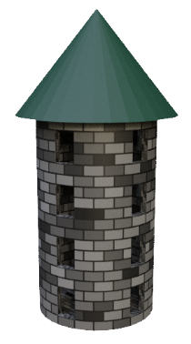
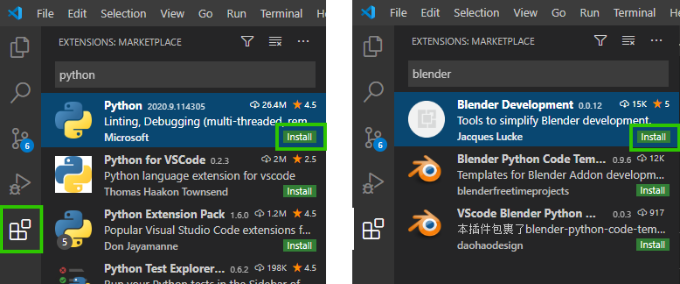
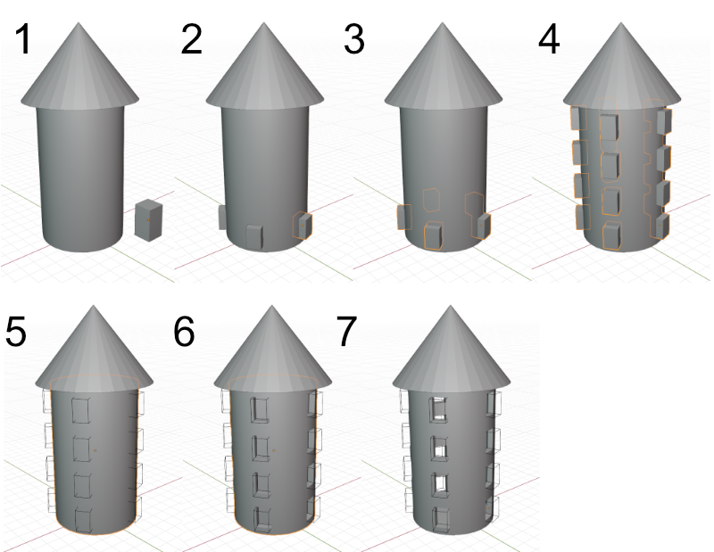




Wenn Scripting-Projekte komplexer werden, wird es irgendwann sehr unpraktisch, nur den Blender-internen Texteditor einzusetzen. Zu diesem Zweck werden wir uns in dieser Übung die Entwicklung mit der IDE Visual Studio Code erleichtern.

Zudem werden wir die verschieden Untermodule der Blender API kennenlernen, um einen Burgturm-Generator zu programmieren.








## Visual Studio Code


- Installiert zunächst [Visual Studio Code](https://code.visualstudio.com/).
- Installiert die zu Blender passende Python-Version (Blender 3.3.1 kommt mit Python 3.10.2) 
- Download für Windows [hier](https://www.python.org/downloads/release/python-3102/)
  - Bei der Option, ob Python zum PATH hinzugefügt werden soll, wählt **JA** - Neustart evtl. erforderlich
- Mit Linux (Ubuntu basierte Distributionen) im Terminal mit `sudo apt-get install python3.10`
- öffnet VS Code und installiert die beiden Extensions **Python** von Microsoft und **Blender Development** von Jacques Lucke.



- Öffnet nun ein Terminal in VS Code (**Teminal → New Terminal**)
- Installiert das fake-bpy-module mit `pip install fake-bpy-module-2.90` (bzw aktuelle Blender Version). Dieses ermöglicht uns Autovervollständigung etc. für die Blender API.
- Wenn ihr nun mi VS Code eine Datei als .py abspeichert und bpy importiert, sollte es keine Fehlermeldungen geben und Autovervollständigung sollte funktionieren.
  - Unten links in VS Code kann (bei offener .py Datei) der Python Interpreter selektiert werden. Wählt hier eure Python 3.7 Version.

<video width="75%" autoplay loop src="img/fake-bpy-module.mp4"></video>



## Das Blender-Python-Modul `bpy`

Wie in anderen Programmiersprachen auch, lassen sich in Python Bibliotheken anlegen, die abrufbare Funktionalität in vordefinierten Klassen und Methoden (Funktionen) bereit halten. Diese heißen in Python _Module_. Um in Python-Skripten für Blender auf die von Blender vorgehaltene Funktionalität zugreifen zu können, steht in Blender-Python-Skripten das Modul `bpy` (Abk. f. _Blender Python_) zur Verfügung. 

In Blender-Skripten muss dieses Modul wie jedes andere Modul auch zunächst mit einer `import`-Anweisung eingebunden werden:

```Python
import bpy

# Rest des Skripts...
```

Wird die in Blender eingebaute interaktive Python-Konsole verwendet, ist dies automatisch schon geschehen, d.h. es kann direkt auf alles, was `bpy` bietet, zugegriffen werden.

### Aufteilung

Das Modul `bpy` bietet die gesamte skript-bare Blender-Funktionalität in acht "Unterebenen" an.


- Gebt auf der Blender-Python-Console nur `bpy.` ein und drückt dann `Strg`-`Leertaste`, bzw. den Button "Autocomplete" 
- Es werden die acht möglichen "Unterebenen" angezeigt.



Von diesen acht Gruppen unterhalb von `bpy` sollen hier die folgenden drei näher betrachtet werden:
- `bpy.ops`
- `bpy.context`
- `bpy.data`
- `bpy.types`

## Die wichtigsten "Untermodule" von `bpy`

### `bpy.context` 

Klassen und Methoden unterhalb von `bpy.context` erlauben den Zugriff auf den aktuellen Kontext, in dem sich der Benutzer befindet wie z.B. Szene, Modus, Selektierte Objekte, Faces, Kanten u. Vertices.

---

###  `bpy.data` 

`bpy.data` ermöglicht den Zugriff auf die interne Datenstruktur der gerade in Blender geöffneten Datei. Letztendlich wird hier das ".blend"-Datenformat abgebildet. Auf alles, was in einer .blend-Datei enthalten ist, kann mit  `bpy.data` Zugegriffen werden. Einen Überblick darüber, was das ist, liefert die *Blender File* Ansicht des Outliners.
Python-Kommandos aus den Tool-Tips, die über Benutzerschnitsstellenelemente von Blender Zugriff auf Daten der Szene ermöglichen, sind meistens über `bpy.data`.

Ein typischer Anwendungsfall ist zum Beispiel der Zugriff auf Materialien. Dieser erfolgt mit 
```python
bpy.data.materials["materialname"]
```





Oft sind Daten über verschiedene Pfade abrufbar. So sind zum Beispiel die [Kameradaten](https://docs.blender.org/manual/en/latest/render/cameras.html) hier entweder über den Aufruf der Liste mit allen Kameradaten der Blender-Datei möglich 

```python
bpy.data.cameras["My_Cam_Data"]
```

**oder** über die [Collection](https://docs.blender.org/manual/en/latest/scene_layout/collections/collections.html), welche das Kameraobjekt *My_Cam_Object* und die ihm zugewiesenen Kameradaten beinhaltet 


```python
bpy.data.collections["Collection"].objects["My_Cam_Object"].data
```



<br>





Zu beachten ist hier, dass *My_Cam_Object* nicht dasselbe ist wie *My_Cam_Data*. Ersteres ist das generische Blender-Objekt - z.b. mit dessen Transformation. Letzteres sind die ihm zugewiesenen Kameradaten - z.b. mit Brennweite und Tiefenunschärfe.



---

### `bpy.ops` 

`bpy.ops` steht für **"Operatoren"**. Hierunter verbergen sich die Kommandos, die über Tastenkombinationen oder Menüeinträge eingegeben werden können. Die Kommandos, die im Arbeitsbereich des Info-Editors angezeigt werden, stammen meistens aus `bpy.ops`.

Zu beachten ist hierbei, dass mach jedem Aufruf eines Operator ein Szenenupdate gemacht wird. In Performancerelevanten Code sollten diese daher sparsam verwendet werden. So kann beispielsweise ein Objekt entweder über den Transform-Operator verschoben,

```python
bpy.ops.transform.translate(value=(1,0,0))
```

oder dessen Position im Raum direkt angesprochen werden:

```python
bpy.context.object.location.x += 1

#bzw nach import von mathutils mit 
bpy.context.object.location += mathutils.Vector((1,0,0))
```

### `bpy.types` 

Dieses Modul enthält Blenders interne Datentypen wie z.b. Objekte, Materialien, Nodes etc. Es kann z.B. für Type Hinting eingesetzt werden.

```python
my_material: bpy.types.Material = bpy.data.materials.new("My Material")
```


## Andere mitgelieferte Module

Neben `bpy` werden auch noch andere Python-Module mit Blender mitgeliefert. Die für uns hier Wichtigen sind Folgende: 

### `mathutils` 

Hier sind u.a. wichtige Typen für das Scripting in Blender und deren Methoden enthalten (`Color`, `Euler`, `Matrix`, `Quaternion`, `Vector`)

---

### `bmesh` 

Gibt Zugriff auf Blenders interne Mesh-Editing API.

---

### `gpu` 

Ermöglicht u.a. das Zeichnen von selbstdefinierten Shadern im Viewport.


## Aufgabe - Burgturm Generator

Nun wollen wir die verschiedenen bpy Module einsetzen, um einen Burgturm bestehend aus einem **Cylinder** und einem **Cone** zu generieren



### Grundform generieren

- Erstellt dazu eine Klasse  `Tower` mit folgenden Membervariablen:
    - `tower_radius`
    - `tower_height`
    - `roof_height`
    - `roof_overhang` (bestimmt wie weit das Dach über die Wand hinausragt)

- Nutzt die folgende Grafik, um eine Methode `generate_tower` zu schreiben, die den Turm in der Szene aufbaut







### Materialien zuweisen

Wir wollen nun das `data` Modul benutzen, um ein Material für die beiden erstellten Objekte zu erstellen.
- Wechselt die 3D-Ansicht zu **Material Preview"


- Erstellt ein neues Material in `bpy.data.materials` mit der `new` Funktion und stellt sicher, dass es das Material-Nodesystem benutzt

```python
mat_tower = bpy.data.materials.new("Tower Base Baterial")
mat_tower.use_nodes = True
```

Wir wollen nun z.B. folgendes Node-Setup generieren, um dem Turm eine Steinziegel-Textur zu verpassen.


- Auf die einzelne Nodes des Materials kann nun über dessen Nodetree de zugegriffen werden.

```python
nodes = mat_tower.node_tree.nodes

# optional mit Type Hinting:
import typing
nodes: typing.List[bpy.types.Nodes] = mat_tower.node_tree.nodes
```

- Jeder Node hat einen Array von Inputs und Outputs, die die Sockel links und rechts repräsentieren. Der erste Input des **Principled BSDF** Shaders ist **Base Color**, daher steuern wir diesen folgendermaßen an: 


```python
nodes["Principled BSDF"].inputs[0].default_value = object_color 
# object_color ist hier die in Übung 1 bereits erstellte Variable
```


- Neue Nodes können über "new" Methode der vorher definierten `nodes` Liste erstellt werden. Die Namen der Shadernodes können (abgesehen von der [bpy.types Dokumentation](https://docs.blender.org/api/current/bpy.types.html)) über die **Python-Tooltips** im **Add** Menü des Shadereditors herausgefunden werden.


```python
node_brick: bpy.types.Node = nodes.new("ShaderNodeTexBrick")
node_coords: bpy.types.Node = nodes.new("ShaderNodeTexCoord")
```

- Um nun die entsprechenden Sockel der Nodes zu verbinden, nutzen wir die `links` Liste des `node_tree` des Materials

```python
# Hier beispielhaft zwei verschiedene Arten des Zugriffs auf die beiden verbundenen Nodes.
# Über die vorher zugewiesene Variable, oder über den Namen des Nodes.
mat_tower.node_tree.links.new(node_brick.outputs[0], nodes["Principled BSDF"].inputs[0])
```

- Erstellt so nun alle benötigten Nodes und Links zwischen ihnen

- Nun weisen wir dem Objekt unser Material zu. Auch hier gibt es mehrere Möglichkeiten.

```python
# dem aktuell selektiertem Objekt
bpy.context.object.data.materials.append(mat_tower)

# oder einem in der Variable tower_base gespeichertem Objekt
tower_base.data.materials.append(mat_tower)

# oder über das data Modul mit dem Objektnamen
bpy.data.objects["Tower Base"].materials.append(mat_tower)
```





### Fenster

Der wohl schwierigste Teil dieser Aufgabe sind die Fenster. Hier werden wir mit Modifiern arbeiten.

- Fügt zunächst der Klasse neue - für die Fenstergenerierung wichtige Variablen hinzu. Gebt den Variablen sinnvolle default Werte

```python
windows_num_circular: int = 5
windows_num_vertical: int = 4
windows_size: float = 1
wall_thickness = 0.5
```

- Wir wollen folgenden Ablauf generieren:
  1. Mehrere Würfel (`windows_num_circular`) in Fenstergröße generieren
  2. Würfel kreisfärmig um den Turm herum anordnen
  3. Würfel zu einem einzigen Objekt verbinden
  4. Würfel mit einem **Array** Modifier vertikal stapeln (`windows_num_vertical`)
  5. Würfel-`display_type` auf `WIRE` setzen, damit die Fenster durchsichtig sind
  6. Turm einen **Boolean-Modifier** hinzufügen, der die Fensterformen aus dem Mesh "herausschneidet"
  7. Towerbase einen **Solidify** Modifier hinzufügen, um der Wand eine Dicke zu geben

  

- Modifier werden Objekten über deren Liste `modifiers` mit der `new` Methode hinzugefügt. Dieser übergeben wir einen (beliebigen) namen und den großgeschriebenen Arraytypen. 

```python
mod_solid = tower_base.modifiers.new('Wall Thickness','SOLIDIFY')
```

- Die Python-Tooltips können wider benutzt werden, um die Pfade zu den einzelnen Parameter der Modifier herauszufinden.

```python
mod_solid.thickness = self.wall_thickness
```



## Ressourcen & Tutorials zum Thema

| Art/Länge | Titel | Beschreibung | Quelle |
|---|---|---|---|
| | [bpy.context Dokumentation](https://docs.blender.org/api/current/bpy.context.html) | Offizielle Blender API Dokumentation | [Blender Python API Dokumentation](https://docs.blender.org/api/current/index.html) |
| | [bpy.data Dokumentation](https://docs.blender.org/api/current/bpy.data.html) | Offizielle Blender API Dokumentation | [Blender Python API Dokumentation](https://docs.blender.org/api/current/index.html) |
| | [bpy.ops Dokumentation](https://docs.blender.org/api/current/bpy.ops.html) | Offizielle Blender API Dokumentation | [Blender Python API Dokumentation](https://docs.blender.org/api/current/index.html) |
| | [bpy.types Dokumentation](https://docs.blender.org/api/current/bpy.types.html) | Offizielle Blender API Dokumentation | [Blender Python API Dokumentation](https://docs.blender.org/api/current/index.html) |
|  23min | [How to create and assign a Material Shader](https://youtu.be/eo7UjKFiagk) | Ausführliches Tutorial zu Materialien in der Blender API | [YouTube -  Darkfall](https://www.youtube.com/channel/UCOUWVGNhcHEICE8AjR8up3g) |
