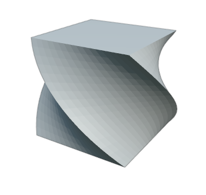
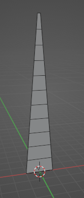
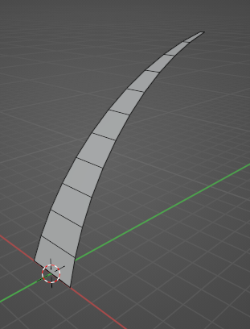
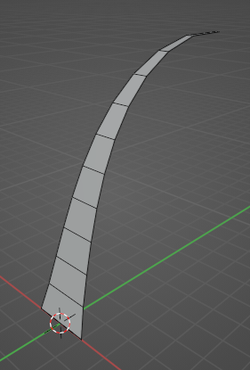

**Basics der Meshgenerierung und -manipulation**

## Vorbereitung

Aktiviere das vorinstallierte Addon **MeasureIt Tols**. Dieses erlaubt es uns, Indices, Positionen und andere Infos des selektierten Objekts im Viewport anzuzeigen.

<video src="./img/measureit.mp4" autoplay loop style="width: 80%;"></video>

Nach der Installation sind dessen Optionen in der Sidebar (Shortcut **N →  View → MeasureIt Tools → Mesh Debug**) zu finden. Das Addon selbst muss noch mit **Show** ganz oben im Panel gestartet werden.


Zu den wichtigsten Aufgaben von Addons gehört die Manipulation und Generierung neuer Meshes. Zur Generierung eines Meshes brauchen Programme dabei grundsätzlich drei Arrays an Daten.

**Vertices**<br>
Diese bestehen aus je drei `floats`, die die Position eines Punktes im Raum auf der X, Y und Z Achse angeben.

**Faces / Polygone**<br>
Diese bestehen je aus einer Liste an integern, die die ID der Vertices im Verticearray angeben, die das Polygon aufspannen. Normalerweise spannen je drei oder vier Vertices ein Polygon auf. In Blender sind jedoch auch N-Gons mit beliebig vielen Vertices möglich. Intern wird für die Grafikkarte alles zu Dreiecken umgerechnet.

**Normalen**<br>
Bestehen aus je drei `floats`, die für jeden Vertice den (normalisierten) Richtungsvektor angeben, der orthogonal auf der Oberfläche steht. Diesen braucht die Software z.b. zur Berechnung von Lichteigenschaften des Meshes. Normalen werden manchmal auch pro Polygon angegeben und die Normalen der anliegenden Vertices werden intern generiert. Generell lassen Normalen oft automatisch generieren.


Neben diesen essentiellen Daten gibt es noch weitere, von denen hier noch zwei genannt werden sollen:

**Edges**<br>
Verbindungen zwischen je zwei Vertixes (anhand deren index). Werden meist nicht extra angegeben, da sie durch die Generierung von Polygonen schon impliziert werden.

**Texturkoordinaten (UVs)**<br>
Wenn das Mesh texturiert werden soll, werden diese benötigt. UVs geben für jeden Vertice zwei `floats` an, die beschreiben, wo sich dieser Vertixe auf einer zweidimensionalen Textur befinden soll.

Hierfür bietet uns die Blender API zwei Möglichkeiten. 

- Die **mesh** Schnittstelle erlaubt uns die schnelle Manipulation von Meshes, indem es uns Zugriff auf dessen einzelne Vertices, Edges und Polygone gibt. 

- Das Modul **bmesh** ist eine weitaus komplexere Bibliothek, die bei komplexeren Mesh-Manipulationen und -Generierungen zum Einsatz kommen sollte.


## Vertices 

Die Vertices  des Meshes werden in dessen Array `vertices` gespeichert. Jeder Vertex hat eine `co` (Coordinates) Variable, die einen Vector mit x,y und z Position des Vertex repräsentiert.

```python
import bpy

currentmesh = bpy.context.object.data

for vert in currentmesh.vertices:
    vert.co.z += 1

currentmesh.update()
```

Um Normalen etc neu zu berechnen, muss das am Ende die `update` Methode des Meshes aufgerufen werden.

Alleine mit der Manipulation der Vertixpositionen kann schon viel erreicht werden. Hier wurde zum Beispiel einer UV-Sphere ein schraubenartiges Muster gegeben:




```python
import bpy
import math

frequency = 10
amplitude = 0.2

currentmesh = bpy.context.object.data

for vert in currentmesh.vertices:
    vert.co.y += amplitude * math.sin(frequency * vert.co.z)
    vert.co.x += amplitude * math.cos(frequency * vert.co.z)

currentmesh.update()
```








Schreibe ein Script, dass einen unterteilten Würfel nach oben hin um 90° verdreht (siehe Bild).



**Tipps:** 

- Die Formel für die Rotation eines zweidimensionalen Vectors um den Nullpunkt um den Winkel *w* ist folgende:<br>
*x' = x ⋅ cos(w) - y ⋅ sin(w)<br>
y' = x ⋅ sin(w) + y ⋅ cos(w)*

- Der Drehwinkel muss abhängig von der Höhe ves Vertex sein.




- Zunächst berechnen wir den Winkel in Radianten, in dem jeder Vertex gedreht wird. Dieser soll abhängig von dessen Höhe z sein. Damit wir unten am Würfel mit 0 beginnen, fügen wir z 1 hinzu (denn der Würfel ist 2 Hoch und hat seine Mitte auf Höhe 1) <br>
`angle = math.radians((vert.co.z + 1) * 45)`

- Nun rotieren wir jeden Vertex auf der Z-Achse um den Nullpunkt. Z bleibt also unverändert. Die obige Formel in Python sieht folgendermaßen aus:<br>
`x = vert.co.x * math.cos(angle) - vert.co.y * math.sin(angle)`<br>
`y = vert.co.x * math.sin(angle) + vert.co.y * math.cos(angle)`

- letztlich weisen wir die so generierten x und y Werte dem Vertex wieder zu<br>
`vert.co.x = x`<br>
`vert.co.y = y`

Der ganze Code sieht also so aus:

```python
import bpy
import math

currentmesh = bpy.context.object.data

for vert in currentmesh.vertices:
    
    angle = math.radians((vert.co.z + 1) * 45)
    
    x = vert.co.x * math.cos(angle) - vert.co.y * math.sin(angle)
    y = vert.co.x * math.sin(angle) + vert.co.y * math.cos(angle)
    
    vert.co.x = x
    vert.co.y = y

currentmesh.update()
```


## Neues Mesh - Pflanzen wachsen lassen

Natürlich können auch komplett neue Meshes generiert werden. Dafür werden wir nun das `bmesh` Modul  verwenden. In diesem Beispiel werden wir eine Graßpflanze erzeugen.

- Zunächst müssen wir sowohl das Mesh, als auch das Objekt erzeugen, dem wir das Mesh als `data` übergeben.

```python
grassblade_mesh = bpy.data.meshes.new("grassblade mesh")
grassblade_object = bpy.data.objects.new("grassblade", grassblade_mesh)
```

- Um das Objekt nun der Szene hinzuzufügen, verlinken wir es in der aktuell ausgewählten *Collection*

```python
grassblade_mesh
```

- Nun kommt das bmesh Modul ins Spiel (importiert es am Anfang der Datei). Wir erzeugen ein neues bmesh anhand des zuvor erstellten Meshes.

```python
bm = bmesh.new()
bm.from_mesh(grassblade_mesh)
```

Neue Vertices und Polygone lassen sich nun folgendermaßen erzeugen:

```python
myvert_1 = bm.verts.new((0,0,0)) #Erzeugt Vertex an Position 0 0 0

myface = bm.faces.new((myvert_1, myvert_2, myvert_3, myvert_4)) #Erzeugt ein Polygon zwischen den angegebenen Vertices

# um Vertices anhand deren indices anzugeben, muss zuerst folgende Methode aufgerufen werden.
bm.verts.ensure_lookup_table() 
myface = bm.faces.new((bm.verts[0], bm.verts[1], bm.verts[2], bm.verts[3]))

```

Nachdem alle Operationen am Mesh durchgeführt wurden, muss das bmesh wieder zum Mesh konvertiert und anschließend entfernt werden:

```python
bm.to_mesh(grassblade_mesh)
bm.free()
```



## Aufgabe: Graßhalmstruktur erzeugen





- Nutzt die oben genannten Möglichkeiten nun, um der Szene ein neues Mesh hinzuzufügen. Dieses soll aus sich nach oben verjüngenden Polygonen bestehen. 

- Anhand der Parameter `HEIGHT, MIN_WIDTH und MAX_WIDTH` soll das Mesh parametrisierbar sein.

- Beachtet, dass die Reihenfolge der Vertices eines Faces mit vier Ecken eine wichtige Rolle spielt.












Um einen Wert innerhalb von 0 und 1 (oder anderer Beliebiger Werte) auf einen neue Skala zu bringen kann die *map range* formel verwendet werden.







### Rotation

Um Drehungen von Vertices umzusetzen können wir eine Drehmatrix nutzen. Zur erzeugung dieser können wir das `mathutils` Modul benutzen. Dabei übergeben wir den Winkel in Radianten, die Größe der Matrix (im 3D Raum 4) und die Achse, um die rotiert werden soll.
 
```python
rot_angle = 45
rotation_matrix = mathutils.Matrix.Rotation(math.radians(rot_angle), 4, 'X') #
```

Um die Matrix nun anzuwenden nutzen wir die `bmesh.ops.rotate` Funktion. Dieser übergeben wir unser bmesh, das Zentrum der Rotation, die Matrix und die Vertices, die rotiert werden sollen.

```python
bmesh.ops.rotate(bm, cent=(0, 0, 0), matrix=rotation_matrix, verts=[v1, v2])
```


## Aufgabe: Graßhalm biegen




- Biegt den Graßhalm, indem ihr die Vertices weiter oben stärker rotiert als die unten. 

- Macht dies mit `ROT_START` (Biegung unten am Halm) und `ROT_END` (Bieung oben) Parametern einstellbar.














- Zusatz: Nutzt die `math.pow` Funktion (Exponentialfunktion), um die Biegung und die Verjüngung des Halms nach oben natürlcher wirken zu lassen.









## Aufgabe: Graßbüschel-Addon



Erzeugt schließlich einen ganzen Graßbüschel, indem ihr mehrere Graßhalme mit randomisierten Parametern und rotationen um die Z-Achse erzeut.








- Verpackt das ganze letztendlich in einen Operator mit sinnvollen Parametern und macht das Skript als Addon installierbar.


